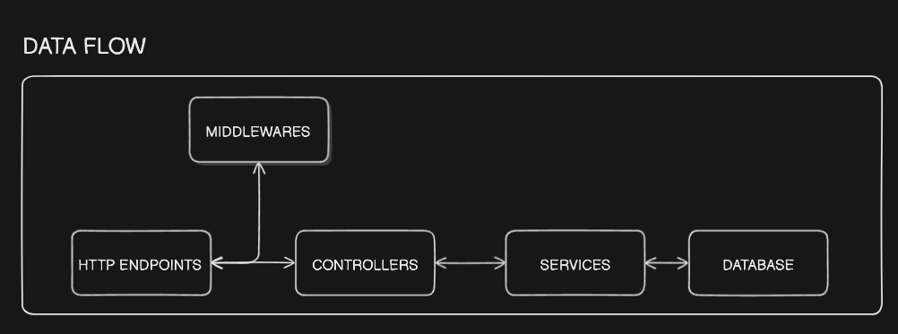

# Build a REST API with Node.js, Express, Mongoose & Typescript.

Note: This project is based on the tutorial from [Tomdoestech](https://www.youtube.com/@TomDoesTech)

Note 1: This repository includes the [postman for finished API](/postman_collection.json)

Note 2: When you clone this repository, copy the .env.example file to .env and fill in the variables.

## Generate new RSA keys: https://travistidwell.com/jsencrypt/demo/

## Base64 encode the keys: https://www.base64encode.org/

# Concepts
- REST API principles
    - CRUD
    - HTTP methods
- Authentication with JWT & refresh tokens
- Request validation

# Technologies
- Node.js
- MongoDB with Mongoose
- Typescript
- Express.js & Express.js middleware
- Zod validation

# Dataflow

# Access & refresh token flow

# Deployment
- Docker (image)
- Docker compose (container)
- Caddy - Web Server
- DigitalOcean